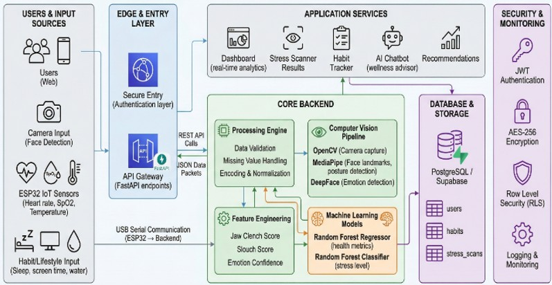

# MindLens AI: Multimodal Stress Detection & Predictive Health Analytics
**MindLens AI** is a digital wellness framework that addresses the lack of real-time, objective stress monitoring. Unlike traditional "single-signal" devices, this system fuses IoT physiological data, computer vision-based behavioral analysis, and lifestyle tracking into a unified machine learning pipeline. It achieves an **87.45%** stress classification accuracy using a transparent, explainable AI approach.

**The Problem**: Over one billion people globally suffer from mental health disorders. Current solutions rely heavily on subjective self-reporting, which lacks the temporal resolution required for early, life-saving intervention.
**The Goal**: Move from "reactive" healthcare (treating symptoms after a breakdown) to "proactive" wellness by detecting physiological and affective stress markers before they escalate.
**The Strategy**: I implemented a "Privacy by Design" architecture, utilizing 10,000 statistically validated synthetic records to train robust models without risking sensitive patient health information (PHI).

## 1. System Architecture
The framework follows a modular three-layer architecture optimized for:
- Real-time data ingestion
- Low-latency processing
- Secure cloud communication
- Scalable AI inference

### A. IoT Layer (Physiological Monitoring)
The IoT layer captures real-time biometric signals using an ESP32 microcontroller.

#### Sensors Used
- **MAX30102 PPG Sensor**
  - Heart Rate
  - SpO2 Monitoring
- **DS18B20 Temperature Sensor**
  - Body Temperature Tracking

#### Features
- Biometric capture every 8 seconds
- Real-time serial communication
- Noise-filtered physiological acquisition
- Low-cost embedded hardware setup

### B. Computer Vision Layer (Affective Analysis)
This layer analyzes facial expressions and behavioral cues for emotion-aware stress detection.

#### Pipeline
1. **OpenCV**
   - Real-time video capture
2. **MediaPipe**
   - Extraction of 478 3D facial landmarks
3. **DeepFace**
   - Emotion classification
   - Confidence range: 88–94%

#### Detected Emotional States
- Stress
- Neutral
- Happy
- Sad
- Fatigue indicators

### C. Analytics & Predictive AI Layer
The analytics engine processes multimodal inputs and predicts stress-related health indicators.

#### Machine Learning Model
- **Multi-Output Random Forest Regressor**

#### Functionalities
- Stress classification
- Physiological forecasting
- Lifestyle impact analysis
- Predictive health analytics

#### Predicted Health Indicators
- Stress level
- Heart rate trend
- Sleep quality impact
- Fatigue estimation
- Wellness score

### D.  AI Wellness Assistant
MindLens AI also integrates a **DeepSeek AI API-based Wellness Assistant** designed to provide intelligent and personalized mental wellness support.

 AI assistant can provide:
- Personalized wellness suggestions
- Stress management recommendations
- Sleep improvement tips
- Productivity and focus guidance
- Emotional wellness support

### Features
- Real-time AI-generated wellness insights
- Personalized user interaction

## 2.Project Structure
MindLens-AI/
├── hardware/             
│   └── ESP32 firmware and sensor integration

├── backend/              
│   ├── api/              
│   ├── middleware/       
│   └── main.py           

├── models/               
│   ├── stress_classifier.pkl
│   └── physiological_regressor.pkl

├── scripts/              
│   ├── mediapipe_processing.py
│   ├── deepface_analysis.py
│   └── data_preprocessing.py

├── database/             
│   └── Supabase PostgreSQL schema

├── dataset/              
│   └── Synthetic multimodal wellness dataset

├── dashboard/            
│   └── Visualization and analytics dashboard

└── README.md

## 3. Tech Stack
**Programming Languages**
Python
C++
SQL

**Backend & APIs**
FastAPI
PySerial
AI/ML Frameworks
Scikit-Learn
OpenCV
MediaPipe
DeepFace
Pandas
NumPy

**Database & Cloud**
Supabase
PostgreSQL

**Security**
AES-256 Encryption
JWT Authentication
Row-Level Security (RLS)

**Hardware Components**
ESP32
MAX30102 Sensor
DHT11 Temperature Sensor

## 4.Key Insights & Outcomes (Result & Decision)
**Quantifiable Accuracy**: The system achieved 86.12% accuracy in physiological forecasting and 87.45% accuracy in stress level classification.

**Explainable AI (XAI)**: I utilized Feature Importance (MDI) to show users exactly which habits (e.g., screen time vs. sleep quality) impacted their stress levels, providing clinical-level transparency.

**Infrastructure Efficiency**: The FastAPI backend ensures affective markers are processed within 10-12 seconds, maintaining a seamless, real-time user experience.

**Future Impact**: This project demonstrates that high-accuracy wellness monitoring is possible using low-cost, non-invasive hardware, significantly lowering the barrier to entry for digital health tools.

## 5. Future Scope
**Wearable Integration**: Transition from stationary USB-serial sensing to low-energy Bluetooth (BLE) wearables for 24/7 continuous monitoring.

**Clinical Validation**: Conduct longitudinal studies with diverse demographic groups to refine algorithmic bias and validate synthetic data performance against clinical hardware.

**Edge AI Deployment**: Optimize models using TensorFlow Lite to enable on-device processing, reducing cloud dependency and further enhancing user privacy.

**Expanded Modalities**: Integrate additional biomarkers such as Galvanic Skin Response (GSR) and voice-based sentiment analysis for a 360-degree affective profile.
